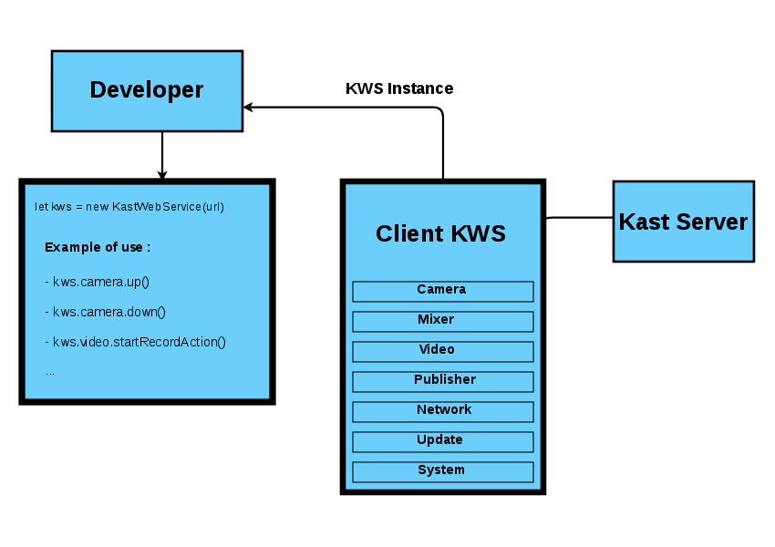

# Kast Client<a id="kastClient"></a>

This client allows you to communicate with KastBox with Websocket Mode and with
HTTP WS Mode (coming soon).

## Installation<a id="installation"></a>

### Using bower

```bash
  bower install kast-client
```

### Using npm

```bash
  npm install kast-client
```

## Usage<a id="usage"></a>

This package allows to communicate with any KastBox with Javascript if you have
registered your application into Kast Administration Panel.

With this service you can build a new UI to interact with Kastbox, you also can
automate tasks.

This sections presents you how to create an UI / Automate system and the keys concepts
of KastBox.  

### Anatomy of Kastbox<a id="anatomy"></a>

KastBox Api are divided into severals apps depending their goals, you can find
below a global description of each.

|   App Name      |      Goal                                                              |  Privileges    |
|:---------------:|------------------------------------------------------------------------|----------------|
| Camera          | Managing the camera (PTZ features / Tracking features)                 |  CAMERA_MGMT   |
| Mixer           | Change stream disposition                                              |  MIXER_MGMT    |
| Video           | Get / Update / Manage all media stored into Kastbox                    |  VIDEO_MGMT    |
| Publisher       | Get / Update / Manage all publishers (Uploading VOD / Live features  ) | PUBLISHER_MGMT |  
| Network         | Manage Network Configuration (Uploading VOD / Live features  )         | NETWORK_MGMT   |  
| Update          | Manage Update                                                          | UPDATE_MGMT    |  
| System          | Get System Information                                                 | MONITOR_MGMT   |  


### Kast Client Schema<a id="schema"></a>




You can see in the above schema the simplest way to execute an action and/or receive a return or a message with **KastClient**.

To start using **KastClient** and all modules it offers, you have to instanciate `KastClient` :

    let kws = new KastClient(url)

`KastClient` connect and create a socket with the server url you mentionned and give you an access to all the features of your KastBox.

**Example :**<a id="example"></a>

    let kast = new KastClient(`url`)

    kast.camera.up() // Execute an action to direct your camera up
    kast.camera.down() // Execute an action to direct your camera down

    kast.video.getList() // Send a request to get the video list

    kast.video.onGetList((`list`) => {
        // you receive the video list in variable `list`
    })


# Kast Modules<a id="kastModules"></a>

## Camera <a id="camera"></a>

**This class is used to execute actions on the camera**

| Function                                      |   Description                                                                               |
|-----------------------------------------------|---------------------------------------------------------------------------------------------|
|`zoomIn()`                                     |Execute a zoom in
|`zoomOut()`                                    |Execute a zoom out
|`zoomStop()`                                   |Stop zoom action
|`up()`                                         |Directs the camera up
|`down()`                                       |Directs the camera down
|`left()`                                       |Directs the camera to the left
|`right()`                                      |Directs the camera to the right
|`startUp()`                                    |Directs the camera up and wait the `stop()` function to stop
|`startDown()`                                  |Directs the camera down and wait the `stop()` function to stop  
|`startLeft()`                                  |Directs the camera to the left and wait the `stop()` function to stop
|`startRight()`                                 |Directs the camera to the right and wait the `stop()` function to stop
|`stop()`                                       |Stop directs actions on camera (`startUp()`, `startDown`(), `startLeft()`, `startRight()`)
|`bigUp()`                                      |Directs the camera up with a big movement
|`bigDown()`                                    |Directs the camera down with a big movement
|`bigLeft()`                                    |Directs the camera to the left with a big movement
|`bigRight()`                                   |Directs the camera to the right with a big movement
|`setSpeakerView()`                             |             
|`goToSpeakerView()`                            |             
|`setFullView()`                                |             
|`goToFullView()`                               |             
|`setMediumView()`                              |             
|`goToMediumView()`                             |             
|`setTrackingZone()`                            |             
|`endSettingTrackingZone()`                     |             
|`startTracking()`                              |             
|`stopTracking()`                               |             
|`mouseUp()`                                    |             
|`mouseDown()`                                  |             
|`mousePosition()`                              |             
|`createRoom()`                                 |             
|`deleteRoom()`                                 |             
|`setRoom()`                                    |             
|`onSetRoom(`*callback(Object room*`)`          |
|`getRoomList()`                                |             
|`onGetRoomList(`*callback([Object] roomList*`)`|
|`getCurrentRoom()`                             |             
|`onGetCurrentRoom(`*callback(Object room*`)`   |

## Audio <a id="audio"></a>

| Function                     | Description                                                                 |
|------------------------------|--------------------------------------------------------------------------------------------------|
|`context()`                   |
|`onContext()`                 |
|`volumeUp()`                  |
|`volumeDown()`                |   

## Video <a id="video"></a>

| Function                               | Description                                                                  |
|----------------------------------------|  ------------------------------------------------------------------------------|
|`getList()`                             |
|`onGetList(`*callback(Object list*`)`   |
|`remove(`*int id*`)`                    |
|`update(`*int id, String title*`)`      |
|`startRecord()`                         |
|`stopRecord()`                          |
|`currentSession()`                      |
|`setSessionTitle()`                     |
|`setSessionSpeaker()`                   |

## Background <a id="background"></a>

| Function                 | Description                                                                  |
|--------------------------|------------------------------------------------------------------------------|
|`get()`                   |
|`getCurrent()`            |
|`set(`*String logo*`)`    |
|`remove(`*String logo*`)` |

## Logo <a id="logo"></a>

| Function                                          | Description                                                                  |
|---------------------------------------------------|------------------------------------------------------------------------------|
|`get()`               |-           |             |
|`getCurrent()`        |-           |             |
|`set()`               |-           |             |
|`remove()`            |-           |             |
|`onLogoList()`        |-           |             |
|`onCurrentLogo()`     |-           |             |
|`onSetLogo()`         |-           |             |

## Mixer <a id="mixer"></a>

| Function                                          | Description                                                                  |
|---------------------------------------------------|------------------------------------------------------------------------------|
|`switchScene(`*int scene_id*`)`                    |
|`setAlphaRGB(`*int r, int g, int b*`)`             |                
|`getAlphaRGB()`                |-                  |                    
|`onGetAlphaRGB(`*Callback(array[r int, g int, b int])*`)`|
|`setAlphaAngle(`*Float angle*`)`                   |
|`getAlphaAngle()`                                  |  
|`onGetAlphaAngle(`*Callback(Float angle*`)`        |
|`setAlphaBW(`*int black, int white*`)`             |
|`getAlphaBW()`                                     |
|`onGetAlphaBW(`*Callback(array[int black, int white])*`)`      |  

## Network <a id="network"></a>

| Function          | Description                                                                  |
|-------------------|------------------------------------------------------------------------------|
|`getInfo()`        |
|`setInfo()`        |
|`restart()`        |
|`onUpdated()`      |

## System <a id="system"></a>

| Function             | Description                                                                  |
|----------------------|------------------------------------------------------------------------------|
|`onLongProcess()`     |
|`onLongProcessEnd()`  |
|`onSuccess()`         |
|`onError()`           |

## Update <a id="update"></a>

| Function               | Description                                                                  |
|------------------------|------------------------------------------------------------------------------|
|`check()`               |
|`onCheckUpdate()`       |
|`onUpdateAvailable()`   |
|`onNoUpdateAvailable()` |
|`onUpdateStart()`       |

## Usb Management <a id="usb"></a>

| Function             | Description                                                                  |
|----------------------|------------------------------------------------------------------------------|
|`deviceList()`        |
|`deviceDirList()`     |
|`copyVideo()`         |
|`copyTemplate()`      |
|`copyBackground()`    |

## Context <a id="context"></a>

| Function                         | Description |
|----------------------------------|-------------|
|`onUpdated(`*Callback(Object context)*`)`|
